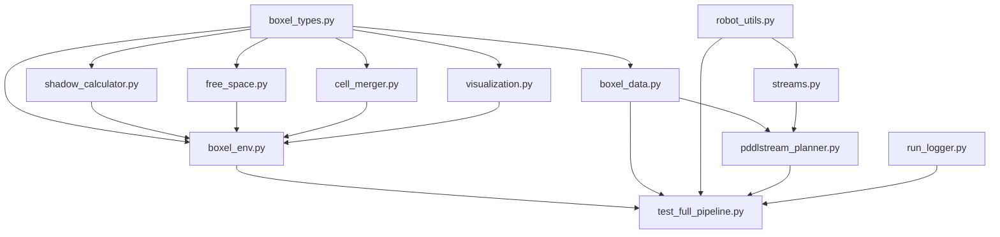
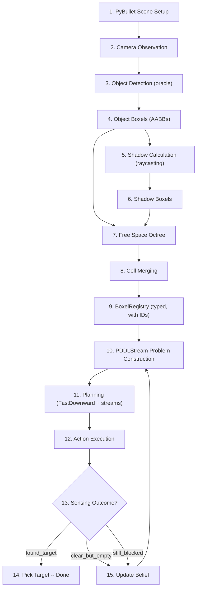

[Back to Home](Home)

# Architecture Overview

## Overview

This page provides a bird's-eye view of the Semantic Boxels system architecture. It shows the module dependency hierarchy, the end-to-end data flow from camera observation through planning to execution, and a summary of every active module in the codebase. For detailed documentation of individual modules, follow the links to the respective pages.

---

## Module Dependency Diagram

The following diagram shows the import relationships between active Python modules. Arrows point from the importing module to the imported module.



---

## Data Flow

The system processes data through a linear pipeline with a replanning feedback loop. Each stage transforms the world state into progressively more abstract representations until the planner can reason symbolically.



### Stage Descriptions

| Stage | Module | Output |
|-------|--------|--------|
| 1. Scene Setup | `boxel_env.py` | PyBullet world with table, robot, occluders, targets |
| 2. Camera Observation | `boxel_env.py` | View matrix, projection matrix from fixed camera |
| 3. Object Detection | `boxel_env.py` (`oracle_detect_objects`) | List of visible object names and poses |
| 4. Object Boxels | `boxel_env.py` (`generate_boxels`) | AABB `Boxel` per visible object |
| 5. Shadow Calculation | `shadow_calculator.py` | Shadow AABBs per occluder, split around obstacles |
| 6. Shadow Boxels | `shadow_calculator.py` | `Boxel` list with `is_shadow=True` |
| 7. Free Space Octree | `free_space.py` | Octree leaf nodes marked FREE |
| 8. Cell Merging | `cell_merger.py` | Merged convex free-space `Boxel` list |
| 9. BoxelRegistry | `boxel_data.py` | `BoxelData` with typed IDs, relationships |
| 10. Problem Construction | `pddlstream_planner.py` | PDDL init facts, goal, stream map |
| 11. Planning | `pddlstream_planner.py` + `streams.py` | Action sequence (move, sense, pick, place) |
| 12. Execution | `test_full_pipeline.py` | Physical robot actions in PyBullet |
| 13-15. Replanning | `test_full_pipeline.py` | Updated `BeliefState`, new plan |

---

## Module Summary

### Active Modules

| Module | Key Class / Function | Purpose | Documented In |
|--------|---------------------|---------|---------------|
| `boxel_types.py` | `ObjectInfo`, `Boxel`, `OctreeNode`, `CameraObservation` | Core data structures shared across all modules | [Core Data Structures](Core_Data_Structures) |
| `boxel_data.py` | `BoxelData`, `BoxelRegistry`, `BoxelType` | Rich boxel representation with IDs, geometry, relationships; JSON serialization | [Core Data Structures](Core_Data_Structures) |
| `boxel_env.py` | `BoxelTestEnv`, `SceneConfig`, `ObjectSpec` | PyBullet environment: scene setup, camera, object creation, boxel generation | [Scene Environment](Scene_Environment) |
| `shadow_calculator.py` | `ShadowCalculator` | Shadow region computation via back-corner raycasting and obstacle splitting | [Spatial Reasoning](Spatial_Reasoning) |
| `free_space.py` | `FreeSpaceGenerator` | Octree-based workspace discretization into free-space cells | [Spatial Reasoning](Spatial_Reasoning) |
| `cell_merger.py` | `CellMerger` | Greedy merging of adjacent free-space cells into larger convex regions | [Spatial Reasoning](Spatial_Reasoning) |
| `streams.py` | `BoxelStreams`, `RobotConfig`, `Trajectory`, `Grasp` | PDDLStream stream generators: grasp sampling, IK, motion planning | [Robot Control and Streams](Robot_Control_and_Streams) |
| `robot_utils.py` | `RenderingLock`, `solve_ik`, `is_config_collision_free` | Franka Panda constants, IK, collision checking, gripper control | [Robot Control and Streams](Robot_Control_and_Streams) |
| `pddlstream_planner.py` | `PDDLStreamPlanner` | PDDLStream integration: problem construction, stream map, plan invocation | [Planning System](Planning_System) |
| `test_full_pipeline.py` | `BeliefState`, `main`, `execute_pick`, `execute_place` | End-to-end pipeline: planning loop, action execution, sensing, replanning | [Execution Pipeline](Execution_Pipeline) |
| `visualization.py` | `BoxelVisualizer` | PyBullet debug drawing for boxels (currently disabled) | [Scene Environment](Scene_Environment) |
| `run_logger.py` | `RunLogger` | Timestamped logging, stdout tee, artefact archiving | [Execution Pipeline](Execution_Pipeline) |

### PDDL Files

| File | Purpose | Documented In |
|------|---------|---------------|
| `pddl/domain_pddlstream.pddl` | TAMP domain: sense, move, pick, place actions; derived predicates for visibility | [PDDL Domain Reference](PDDL_Domain_Reference) |
| `pddl/stream.pddl` | Stream declarations: sample-grasp, plan-motion, compute-kin | [PDDL Domain Reference](PDDL_Domain_Reference) |
| `pddl/problem_debug.pddl` | Debug export of the static init state (generated at runtime) | [Planning System](Planning_System) |

### Data Files

| File | Purpose |
|------|---------|
| `boxel_data.json` | Generated boxel registry (output of each run) |
| `requirements.txt` | Python dependencies (numpy, pybullet) |
| `SESSION_HANDOFF.md` | Session handoff notes between development sessions |
| `CODEBASE_AUDIT.txt` | Open audit issues and codebase policy |

### Archive

The `archive/` directory contains superseded implementations preserved for reference:

| File | What It Was |
|------|-------------|
| `config.py` | PDDLStream path setup (now hardcoded) |
| `boxel_test_env.py` | Older BoxelTestEnv (replaced by `boxel_env.py`) |
| `problem_generator.py` | PDDL problem generation (now in `pddlstream_planner.py`) |
| `executor.py` | Legacy plan executor with replanning |
| `hidden_object_scenario.py` | Scenario logic (now in `test_full_pipeline.py`) |
| `run_demo.py`, `run_tamp_demo.py`, `run_gui_demo.py` | Original demo entry points |
| `test_robot_control.py`, `test_pddl_integration.py`, `test_wsl_pddlstream.py`, `test_pybullet.py` | Legacy test scripts |
| `pddl/domain_boxel_tamp.pddl`, `pddl/problem_template.pddl`, `pddl/problem_generated.pddl` | Old PDDL files |
| `CODEBASE_AUDIT_RESOLVED.txt` | Archived resolved audit issues |

---

## File Structure

```
Semantic_Boxels/
├── boxel_types.py              # Core data structures (Boxel, ObjectInfo, OctreeNode)
├── boxel_data.py               # BoxelData, BoxelRegistry, BoxelType enum
├── boxel_env.py                # PyBullet environment, scene setup, camera
├── shadow_calculator.py        # Shadow region computation (raycasting)
├── free_space.py               # Octree free-space discretization
├── cell_merger.py              # Greedy cell merging
├── streams.py                  # PDDLStream streams (IK, motion, grasps)
├── robot_utils.py              # Panda constants, IK, collision checking
├── pddlstream_planner.py       # PDDLStream planner integration
├── test_full_pipeline.py       # Main entry point: planning + execution loop
├── visualization.py            # PyBullet debug drawing (disabled)
├── run_logger.py               # Timestamped logging service
├── boxel_data.json             # Generated output
├── requirements.txt            # Dependencies
├── README.md                   # Project overview
├── CODEBASE_AUDIT.txt          # Open issues
├── SESSION_HANDOFF.md          # Dev session notes
├── pddl/
│   ├── domain_pddlstream.pddl # TAMP domain (actions + derived predicates)
│   ├── stream.pddl            # Stream declarations
│   └── problem_debug.pddl     # Debug problem export
├── logs/                       # Auto-generated run logs
│   └── run_<timestamp>/
├── archive/                    # Superseded implementations
│   ├── *.py                   # Old modules
│   ├── pddl/                  # Old PDDL files
│   └── CODEBASE_AUDIT_RESOLVED.txt
└── wiki/                       # This documentation
```

---

## Design Patterns

### 1. Pipeline Architecture

The system follows a strict pipeline: perception produces boxels, boxels are registered and classified, the registry feeds the planner, and the planner produces actions for execution. Each stage has a well-defined input/output contract, allowing modules to be developed and tested independently.

### 2. Streams as Geometry Bridges

PDDLStream's stream abstraction bridges the gap between symbolic planning and geometric reasoning. The three streams (`sample-grasp`, `plan-motion`, `compute-kin`) lazily generate geometric solutions (grasp poses, IK configurations, collision-free trajectories) on demand during symbolic search. This avoids pre-computing the entire geometric space.

### 3. Optimistic Planning with Reactive Replanning

The planner assumes sensing will find the target (optimistic). When execution reveals otherwise, the belief state is updated and a new plan is generated with strictly fewer candidates. This pattern converges in at most N replan cycles for N shadow candidates. See [Design Decisions](Design_Decisions) for the full justification.

### 4. Derived Predicates for Automatic Visibility

Rather than manually tracking which shadows are visible after each object relocation, the PDDL domain uses derived predicates (`blocks_view`, `view_blocked`, `view_clear`) that are automatically recomputed from `obj_at_boxel` positions. Moving an occluder automatically clears the view -- no explicit visibility bookkeeping needed.

---

**See Also:**
- [Core Data Structures](Core_Data_Structures) -- The types that flow through this architecture.
- [Execution Pipeline](Execution_Pipeline) -- A concrete walkthrough of the full pipeline.
- [Design Decisions](Design_Decisions) -- Why the architecture is shaped this way.

---

[Back to Home](Home)
