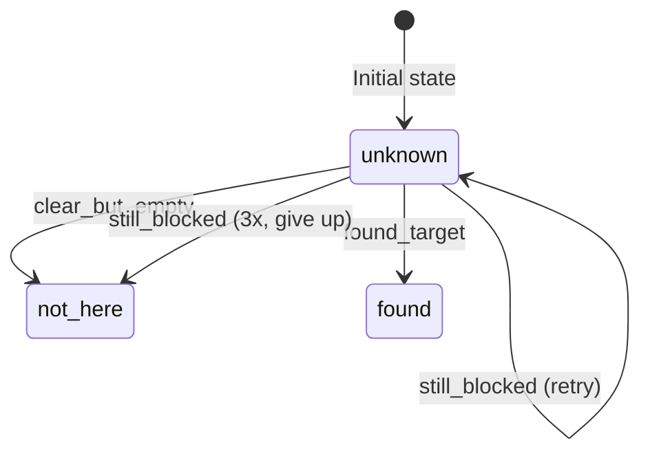

[Back to Home](Home)

# Execution Pipeline

## Overview

This page documents the end-to-end pipeline implemented in `test_full_pipeline.py` -- the main entry point for the Semantic Boxels system. The pipeline proceeds through eight phases: environment setup, perception, spatial reasoning, scenario construction, planning, and execution with reactive replanning. A concrete walkthrough of the default scene demonstrates how all components work together to find a hidden target.

---

## Pipeline Phases

### Phase 1: Environment Setup

```python
env = BoxelTestEnv(gui=not args.no_gui, scene_config=scene_config)
```

1. Create the `BoxelTestEnv` with the selected scene preset (see [Scene Environment](Scene_Environment)).
2. Run 50 physics settling steps (`p.stepSimulation()`) to let objects stabilize under gravity.
3. Call `env.update_object_positions()` to sync internal state with settled poses.

### Phase 2: Camera Observation and Boxel Generation

```python
obs = env.get_camera_observation()
all_boxels = obs.boxels
```

1. `oracle_detect_objects()` determines which objects are visible from the camera.
2. `generate_boxels()` produces object boxels (AABBs) and shadow boxels (via `ShadowCalculator`) for each visible object.

### Phase 3: Free Space and Cell Merging

```python
free_space_boxels = env.generate_free_space(all_boxels)
merged_free = merge_free_space_cells(free_space_boxels)
all_boxels = all_boxels + merged_free
```

1. `FreeSpaceGenerator` runs octree BFS subdivision over the workspace.
2. `merge_free_space_cells()` combines adjacent free cells into larger convex regions.
3. Merged free-space boxels are appended to the full boxel list.

### Phase 4: Registry Creation and Export

```python
registry = create_boxel_registry_from_boxels(all_boxels)
registry.save_to_json("boxel_data.json")
```

1. Convert the flat `Boxel` list into a typed `BoxelRegistry` (see [Spatial Reasoning](Spatial_Reasoning)).
2. Save to JSON for debugging and artefact archiving.

### Phase 5: Hidden-Object Scenario

```python
# Determine which target is actually hidden in a shadow
target_name, target_shadow = find_hidden_target(registry, env)
```

1. For each target, check if its position falls within any shadow boxel's AABB.
2. Select one hidden target as the search objective.
3. If no target is hidden (all visible), the scenario exits -- no search needed.

### Phase 6: Shadow Blocker Computation

```python
shadow_occluder_map = compute_shadow_blockers(env, registry)
```

`compute_shadow_blockers()` uses a 5x5 ray grid per shadow to determine ALL objects blocking the camera's view to each shadow region. This is more comprehensive than just the shadow's creating occluder -- any object in the camera-to-shadow corridor is detected.

The map is `Dict[shadow_id, List[blocker_ids]]` and is passed to the planner for `blocks_view_at` facts.

### Phase 7: Planning Loop

```python
belief = BeliefState(shadow_ids)
max_replans = 4 * len(shadows) + 1

for replan_idx in range(max_replans):
    plan = planner.plan(
        current_config=current_config,
        known_empty_shadows=belief.known_empty_shadows,
        moved_occluders=belief.occluders_moved
    )
    success = execute_plan(plan, ...)
    if success:
        break
```

The outer loop manages replanning. Each iteration:
1. Constructs a PDDL problem with current belief state.
2. Calls PDDLStream `solve()` (see [Planning System](Planning_System)).
3. Executes the plan action-by-action.
4. If sensing fails (target not found), updates belief and loops.

### Phase 8: Action Execution

Each action in the plan is dispatched to its handler. See the detailed action handlers below.

---

## Action Handlers

### move

**PDDL:** `move(?q1, ?q2, ?b, ?t)`  
**Handler:** Trajectory waypoint iteration.

```
For each waypoint in traj.waypoints[1:]:
    move_robot_smooth(robot_id, waypoint.joint_positions, gui)
current_config = read actual joint state from PyBullet
```

The first waypoint is skipped (it is the start configuration). Each subsequent waypoint is executed via position-controlled motor commands. After the full trajectory, the actual joint state is read from PyBullet and stored as `current_config` for the next planning cycle.

### sense

**PDDL:** `sense(?o, ?region)`  
**Handler:** Camera raycasting with arm retraction.

**Step 1 -- Move arm home:**
Before sensing, the arm is moved to the home configuration to prevent it from blocking the camera's view. This is a hidden sub-action not modeled in PDDL (see [Design Decisions](Design_Decisions), #93).

**Step 2 -- Raycast:**
`sense_shadow_raycasting()` fires a 7x7 ray grid from the camera into the shadow volume at 3 Z levels:

| Z Level | Height | Purpose |
|---------|--------|---------|
| Low | `shadow_z_min + 0.04` | Near the table surface. |
| Mid | `shadow_z_min + 0.33 * height` | Lower-third of shadow. |
| High | `shadow_z_min + 0.67 * height` | Upper-third of shadow. |

For each of the 7x7 = 49 XY grid points at each Z level (147 total rays):
- Cast a ray from the camera to the grid point.
- Check if the first-hit body is: the target, an occluder, or the robot arm.

**Step 3 -- Outcome determination:**

| Outcome | Condition | Action |
|---------|-----------|--------|
| `found_target` | Any ray hits the target's body ID | Mark shadow as `"found"`. Proceed to pick. |
| `clear_but_empty` | Majority of rays reach the shadow without hitting an occluder, but none hit the target | Mark shadow as `"not_here"`. Add to `known_empty_shadows`. Trigger replan. |
| `still_blocked` | Majority of rays hit an occluder or robot | Increment blocked counter for this shadow. If 3 consecutive blocked outcomes, mark as empty and move on. Trigger replan. |

### pick

**PDDL:** `pick(?o, ?b, ?g, ?q)`  
**Handler:** `execute_pick(robot_id, env, obj_name, obj_pos, grasp, config, gui)`

A 6-step choreographed sequence:

| Step | Action | Height | IK Source |
|------|--------|--------|-----------|
| 1 | Open gripper | N/A | N/A |
| 2 | Move to approach | `contact_z + 0.10 m` | `solve_ik()` at approach position |
| 3 | Lower to contact | Object center + grasp offset | Plan's `config.joint_positions` |
| 4 | Close gripper | Same | N/A |
| 5 | Attach constraint | Same | `p.createConstraint(JOINT_FIXED)` |
| 6 | Lift | `contact_z + 0.25 m` | `solve_ik()` at lift position |

**IK strategy:**
- The contact position uses the plan's pre-computed IK solution.
- Approach and lift positions use execution-time IK via `solve_ik()`, since these waypoints are not computed during planning.
- If contact IK fails, the function returns `None`, triggering a replan.

**Constraint attachment:**
`p.createConstraint(parentBodyUniqueId=robot_id, childBodyUniqueId=object_id, jointType=JOINT_FIXED)` welds the object to the end-effector. This is not friction-based grasping -- it is a rigid attachment that holds regardless of object size or weight. See [Design Decisions](Design_Decisions) for the rationale.

The function returns the `constraint_id` so the caller can release it during place.

### place

**PDDL:** `place(?o, ?b, ?g, ?q)`  
**Handler:** `execute_place(robot_id, env, obj_name, place_pos, grasp, config, constraint_id, gui)`

A 5-step sequence:

| Step | Action | Height | IK Source |
|------|--------|--------|-----------|
| 1 | Move to approach | `place_z + 0.25 m` | `solve_ik()` |
| 2 | Lower to contact | Place position + grasp offset | Plan's `config.joint_positions` |
| 3 | Open gripper | Same | N/A |
| 4 | Remove constraint | Same | `p.removeConstraint(constraint_id)` |
| 5 | Retreat upward | `place_z + 0.25 m` | `solve_ik()` |

After placing:
- 30 physics settling steps allow the object to stabilize.
- `env.update_object_positions()` syncs all positions.
- `belief.occluders_moved[occluder_id] = destination_boxel_id` is recorded.

---

## Replanning Logic

### BeliefState Updates

After each sensing action, the belief state is updated:



| Transition | BeliefState Change | Planner Effect |
|------------|-------------------|----------------|
| `found_target` | `shadow_status[s] = "found"` | Plan proceeds to pick the target. |
| `clear_but_empty` | `shadow_status[s] = "not_here"`, add to `known_empty_shadows` | Next plan skips this shadow. |
| `still_blocked` (retry) | No change | Same plan retried or replanned. |
| `still_blocked` (3x) | Treat as empty, add to `known_empty_shadows` | Next plan skips this shadow. |

### Max Replans Formula

```
max_replans = 4 * len(shadows) + 1
```

The multiplier of 4 accounts for: 1 initial plan + up to 3 blocked retries per shadow. The +1 provides a final attempt after all shadows have been processed.

---

## Concrete Scenario Walkthrough

The following walkthrough traces a typical run with the default scene (3 occluders, 4 targets).

### Setup

- **Occluders**: `occluder_1` at (0.5, 0.2), `occluder_2` at (0.3, -0.1), `occluder_3` at (0.7, -0.1).
- **Targets**: 3 visible, 1 hidden behind `occluder_1` in `shadow_001`.
- **Goal**: Find and retrieve `target_2`.

### Perception

- `oracle_detect_objects()` identifies 6 visible objects (3 occluders + 3 visible targets). `target_2` is not visible.
- `generate_boxels()` produces 6 object boxels + ~6 shadow boxels.
- Free-space generation yields ~47 cells, merged to ~12 larger regions.
- `BoxelRegistry` contains ~25 boxels total.

### Scenario

- AABB containment check: `target_2`'s position falls within `shadow_001`.
- `shadow_occluder_map`: `shadow_001` is blocked by `obj_004` (occluder_1).

### Plan #1

The planner produces:

```
1. move(q_home, q_kin_obj_004_1, obj_004, traj_1)     -- Move to occluder_1
2. pick(obj_004, obj_004, grasp_0, q_kin_obj_004_1)    -- Pick up occluder_1
3. move(q_kin_obj_004_1, q_kin_obj_004_3, free_023, traj_2)  -- Move to free space
4. place(obj_004, free_023, grasp_0, q_kin_obj_004_3)  -- Place occluder_1 in free space
5. sense(target_2, shadow_001)                         -- Sense the now-clear shadow
6. move(q_kin_obj_004_3, q_kin_target_2_0, shadow_001, traj_3)  -- Move to target
7. pick(target_2, shadow_001, grasp_1, q_kin_target_2_0)       -- Pick up target
```

### Execution

1. **move**: Robot arm follows trajectory to occluder_1's pick position.
2. **pick**: Open gripper, approach, lower, close gripper, attach constraint, lift.
3. **move**: Carry occluder_1 to free-space boxel `free_023`.
4. **place**: Lower, open gripper, release constraint, retreat. Occluder_1 is now in free space.
5. **sense**: Arm moves home. Camera raycasts into shadow_001. Rays hit `target_2`. Outcome: `found_target`.
6. **move**: Robot navigates to target_2's pick position.
7. **pick**: Grasp target_2.

**Result: Success** -- target found and retrieved in a single plan.

### Alternative: Target Not in First Shadow

If `target_2` were behind `occluder_3` instead:

- Plan #1 moves `occluder_1`, senses `shadow_001` -- finds nothing (`clear_but_empty`).
- Belief update: `known_empty_shadows = {"shadow_001"}`.
- Plan #2 receives the updated belief. It plans to move `occluder_3`, sense `shadow_003`.
- Sensing finds `target_2`. Plan #2 completes with a pick action.

**Result: Success** -- target found in 2 replan cycles.

---

## Logging

`RunLogger` (from `run_logger.py`) provides comprehensive logging throughout the pipeline:

- **Stdout tee**: All print output is captured to both console and a timestamped log file.
- **Python logging**: File handler at DEBUG level, console handler at the selected verbosity.
- **Artefacts**: `boxel_data.json` and `problem_debug.pddl` are copied into the run directory.

Each run creates `logs/run_<timestamp>/` containing:
- `run_<timestamp>.log` -- full output.
- `boxel_data.json` -- scene snapshot.
- `problem_initial.pddl` -- PDDL problem export.

---

**See Also:**
- [Planning System](Planning_System) -- How plans are constructed and how replanning works.
- [Robot Control and Streams](Robot_Control_and_Streams) -- The IK, motion planning, and actuation functions called during execution.
- [Scene Environment](Scene_Environment) -- The PyBullet environment that execution operates within.
- [PDDL Domain Reference](PDDL_Domain_Reference) -- The PDDL actions that map to these execution handlers.
- [Design Decisions](Design_Decisions) -- Why actions contain hidden sub-actions (#93), why constraint-based grasping is used.

---

[Back to Home](Home)
