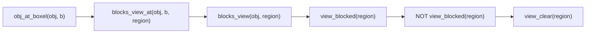

[Back to Home](Home)

# PDDL Domain Reference

## Overview

This page is the formal reference for the PDDL domain (`pddl/domain_pddlstream.pddl`) and stream definitions (`pddl/stream.pddl`) that drive the Semantic Boxels planner. The domain models the robot's capabilities -- sensing, moving, picking, and placing -- using derived predicates for automatic visibility reasoning and Know-If fluents for partial observability. The streams bridge symbolic planning with geometric computation.

---

## Domain Declaration

```
(define (domain boxel-tamp)
  (:requirements :strips :equality :derived-predicates)
  ...
)
```

| Requirement | Purpose |
|-------------|---------|
| `:strips` | Standard PDDL action semantics (preconditions and effects). |
| `:equality` | Allows `(= ?x ?y)` tests in preconditions. |
| `:derived-predicates` | Enables computed predicates (`blocks_view`, `view_blocked`, `view_clear`) that are automatically re-evaluated when the state changes. |

The domain is **untyped** -- object types are encoded as predicates (`(Boxel ?x)`, `(Obj ?x)`, etc.) rather than PDDL types. This is a PDDLStream convention that simplifies stream integration.

---

## Predicates

### Type Predicates

| Predicate | Arity | Explanation |
|-----------|-------|-------------|
| `(Boxel ?x)` | 1 | `?x` is a boxel (object, shadow, or free-space region). |
| `(Obj ?x)` | 1 | `?x` is a manipulable object (occluder or target). |
| `(Config ?x)` | 1 | `?x` is a robot joint configuration. |
| `(Trajectory ?x)` | 1 | `?x` is a collision-free trajectory. |
| `(Grasp ?x)` | 1 | `?x` is a grasp pose. |

### Boxel Classification Predicates (Static)

| Predicate | Arity | Explanation |
|-----------|-------|-------------|
| `(is_shadow ?b)` | 1 | `?b` is a shadow region (not directly visible from camera). |
| `(is_object ?b)` | 1 | `?b` is a physical object's bounding box. |
| `(is_free_space ?b)` | 1 | `?b` is known empty space (valid placement destination). |

### Visibility Predicates

| Predicate | Arity | Kind | Explanation |
|-----------|-------|------|-------------|
| `(blocks_view_at ?obj ?b ?region)` | 3 | Static | Geometric fact: when object `?obj` is at position `?b`, it blocks the camera's view to shadow `?region`. Set in the init state from `shadow_occluder_map`. |
| `(blocks_view ?obj ?region)` | 2 | Derived | True when `?obj` is currently at a position that blocks view to `?region`. |
| `(view_blocked ?region)` | 1 | Derived | True when any object blocks view to `?region`. |
| `(view_clear ?region)` | 1 | Derived | True when `?region` is a shadow with no blocking objects. |

### World State Predicates (Fluent)

| Predicate | Arity | Explanation |
|-----------|-------|-------------|
| `(obj_at_boxel ?o ?b)` | 2 | Object `?o` is physically at boxel `?b`. Modified by pick/place effects. |
| `(obj_at_boxel_KIF ?o ?b)` | 2 | We KNOW whether `?o` is at `?b` (Know-If fluent). Modified by sense effects. |
| `(at_config ?q)` | 1 | The robot is at configuration `?q`. Modified by move effects. |
| `(handempty)` | 0 | The robot's gripper is empty. Modified by pick/place effects. |
| `(holding ?o)` | 1 | The robot is holding object `?o`. Modified by pick/place effects. |
| `(obj_pose_known ?o)` | 1 | The pose of object `?o` is known (sensing succeeded). This is the goal predicate. |

### Stream-Certified Predicates

| Predicate | Arity | Explanation |
|-----------|-------|-------------|
| `(valid_grasp ?o ?g)` | 2 | Grasp `?g` is valid for object `?o`. Certified by `sample-grasp`. |
| `(motion ?q1 ?q2 ?t)` | 3 | Trajectory `?t` connects configs `?q1` and `?q2`. Certified by `plan-motion`. |
| `(kin_solution ?o ?b ?g ?q)` | 4 | Config `?q` places the end-effector at boxel `?b` for object `?o` with grasp `?g`. Certified by `compute-kin`. |
| `(config_for_boxel ?q ?b)` | 2 | Config `?q` targets boxel `?b`. Certified by `compute-kin`. |

---

## Derived Predicates

The visibility chain uses stratified negation to automatically compute which shadows are observable:



### `blocks_view` (Derived)

```
(:derived (blocks_view ?obj ?region)
  (exists (?b)
    (and (obj_at_boxel ?obj ?b)
         (blocks_view_at ?obj ?b ?region))))
```

True when object `?obj` is currently at some position `?b` that geometrically blocks the camera's view to `?region`. This is the dynamic version of the static `blocks_view_at` -- it re-evaluates whenever `obj_at_boxel` changes.

### `view_blocked` (Derived)

```
(:derived (view_blocked ?region)
  (exists (?obj)
    (blocks_view ?obj ?region)))
```

True when ANY object currently blocks the view to `?region`.

### `view_clear` (Derived)

```
(:derived (view_clear ?region)
  (and (Boxel ?region)
       (is_shadow ?region)
       (not (view_blocked ?region))))
```

True when `?region` is a shadow with NO blocking objects. This is the precondition for the `sense` action.

**Key insight:** When the planner generates a pick-and-place plan to relocate an occluder, the occluder's `obj_at_boxel` changes from its original position to the free-space destination. The derived predicates automatically re-evaluate: `blocks_view` becomes false for the original position, `view_blocked` becomes false, and `view_clear` becomes true. No explicit visibility bookkeeping is needed in the action effects.

---

## Actions

### sense

Observe a shadow region to check for the target object.

| Component | Value |
|-----------|-------|
| **Parameters** | `?o` (target object), `?region` (shadow boxel) |
| **Preconditions** | `(Obj ?o)`, `(Boxel ?region)`, `(view_clear ?region)`, `(not (obj_at_boxel_KIF ?o ?region))` |
| **Effects** | `(obj_at_boxel_KIF ?o ?region)`, `(obj_at_boxel ?o ?region)` [optimistic], `(obj_pose_known ?o)` |

The sense action is **optimistic**: it assumes the target will be found. When execution reveals otherwise, the execution loop triggers replanning. See [Design Decisions](Design_Decisions) for the justification.

The precondition `(not (obj_at_boxel_KIF ?o ?region))` ensures the planner only senses shadows where the target's presence is unknown.

### move

Move the robot arm from one configuration to another along a trajectory.

| Component | Value |
|-----------|-------|
| **Parameters** | `?q1` (start config), `?q2` (goal config), `?b` (destination boxel), `?t` (trajectory) |
| **Preconditions** | `(Config ?q1)`, `(Config ?q2)`, `(Boxel ?b)`, `(Trajectory ?t)`, `(at_config ?q1)`, `(config_for_boxel ?q2 ?b)`, `(motion ?q1 ?q2 ?t)` |
| **Effects** | `(at_config ?q2)`, `(not (at_config ?q1))` |

The `?b` parameter links the move to the destination boxel. The `(config_for_boxel ?q2 ?b)` precondition ensures the goal configuration was computed for that specific boxel.

### pick

Pick up an object from a boxel.

| Component | Value |
|-----------|-------|
| **Parameters** | `?o` (object), `?b` (boxel), `?g` (grasp), `?q` (config) |
| **Preconditions** | `(Obj ?o)`, `(Boxel ?b)`, `(Grasp ?g)`, `(Config ?q)`, `(handempty)`, `(at_config ?q)`, `(obj_at_boxel_KIF ?o ?b)`, `(obj_at_boxel ?o ?b)`, `(kin_solution ?o ?b ?g ?q)` |
| **Effects** | `(holding ?o)`, `(not (handempty))`, `(not (obj_at_boxel ?o ?b))` |

Both `obj_at_boxel_KIF` and `obj_at_boxel` are required: the robot must KNOW the object is there AND the object must actually BE there. This prevents the planner from generating pick actions for objects at unknown locations.

**Accepted simplification:** pick does not update `at_config`. The robot physically moves to approach/contact/lift positions during execution, but the PDDL state still shows `(at_config ?q)`. This drift is compensated by the replanning loop, which re-initializes `at_config` from the robot's actual joints before each new plan. See audit entry #62.

### place

Place a held object in a free-space boxel.

| Component | Value |
|-----------|-------|
| **Parameters** | `?o` (object), `?b` (destination boxel), `?g` (grasp), `?q` (config) |
| **Preconditions** | `(Obj ?o)`, `(Boxel ?b)`, `(Grasp ?g)`, `(Config ?q)`, `(holding ?o)`, `(at_config ?q)`, `(is_free_space ?b)`, `(kin_solution ?o ?b ?g ?q)` |
| **Effects** | `(handempty)`, `(obj_at_boxel ?o ?b)`, `(obj_at_boxel_KIF ?o ?b)`, `(not (holding ?o))` |

The `(is_free_space ?b)` precondition ensures objects are only placed in known empty regions. After placement, the object's position is updated, which causes the derived visibility predicates to re-evaluate.

---

## Streams

**File:** `pddl/stream.pddl`

### sample-grasp

| Field | Value |
|-------|-------|
| **Inputs** | `?o` (object) |
| **Domain** | `(Obj ?o)` |
| **Outputs** | `?g` (grasp) |
| **Certified** | `(Grasp ?g)`, `(valid_grasp ?o ?g)` |
| **Python** | `BoxelStreams.sample_grasp()` |

### plan-motion

| Field | Value |
|-------|-------|
| **Inputs** | `?q1`, `?q2` (configs) |
| **Domain** | `(Config ?q1)`, `(Config ?q2)` |
| **Outputs** | `?t` (trajectory) |
| **Certified** | `(Trajectory ?t)`, `(motion ?q1 ?q2 ?t)` |
| **Python** | `BoxelStreams.plan_motion()` |

### compute-kin

| Field | Value |
|-------|-------|
| **Inputs** | `?o` (object), `?b` (boxel), `?g` (grasp) |
| **Domain** | `(Obj ?o)`, `(Boxel ?b)`, `(valid_grasp ?o ?g)` |
| **Outputs** | `?q` (config) |
| **Certified** | `(Config ?q)`, `(kin_solution ?o ?b ?g ?q)`, `(config_for_boxel ?q ?b)` |
| **Python** | `BoxelStreams.compute_kin_solution()` |

---

## PDDL / Python Alignment

The following table cross-references each PDDL action with its Python execution handler, noting any mismatches.

| ID | PDDL Action | Python Handler | Status | Notes |
|----|-------------|---------------|--------|-------|
| PF-1 | `sense(?o, ?region)` | Sense handler in `test_full_pipeline.py` | **Mismatch (accepted)** | PDDL is optimistic (assumes found). Python is tri-state (found / empty / blocked) with reactive replanning. See #61. |
| PF-2 | `pick(?o, ?b, ?g, ?q)` | `execute_pick()` in `test_full_pipeline.py` | **Mismatch (documented)** | Python executes a 6-step sequence (open, approach, contact, close, attach, lift) with 3 hidden IK solves. PDDL models as instantaneous. Does not update `at_config`. |
| PF-3 | `place(?o, ?b, ?g, ?q)` | `execute_place()` in `test_full_pipeline.py` | **Mismatch (documented)** | Same pattern as PF-2: Python executes approach, lower, open, detach, retreat with 3 hidden IK solves and 30 settling steps. |
| PF-4 | `move(?q1, ?q2, ?b, ?t)` | Move handler in `test_full_pipeline.py` | **Consistent** | Python iterates through trajectory waypoints as planned. |
| PF-5 | `compute-kin` stream | `BoxelStreams.compute_kin_solution()` | **Hidden side-channel** | `ignored_body_ids` is stored in the Python `RobotConfig` object but invisible in the PDDL declaration. `plan_motion()` reads it for collision exclusion. Architecturally sound for PDDLStream but invisible to formal analysis. |

---

**See Also:**
- [Planning System](Planning_System) -- How the domain and streams are loaded and used during problem construction.
- [Robot Control and Streams](Robot_Control_and_Streams) -- The Python implementations of the three streams.
- [Execution Pipeline](Execution_Pipeline) -- The Python action handlers that execute PDDL actions.
- [Design Decisions](Design_Decisions) -- Rationale for optimistic sensing, hidden sub-actions, and other deviations.

---

[Back to Home](Home)
