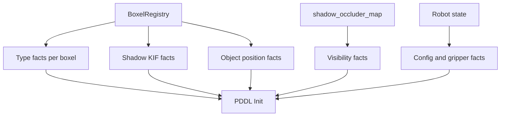
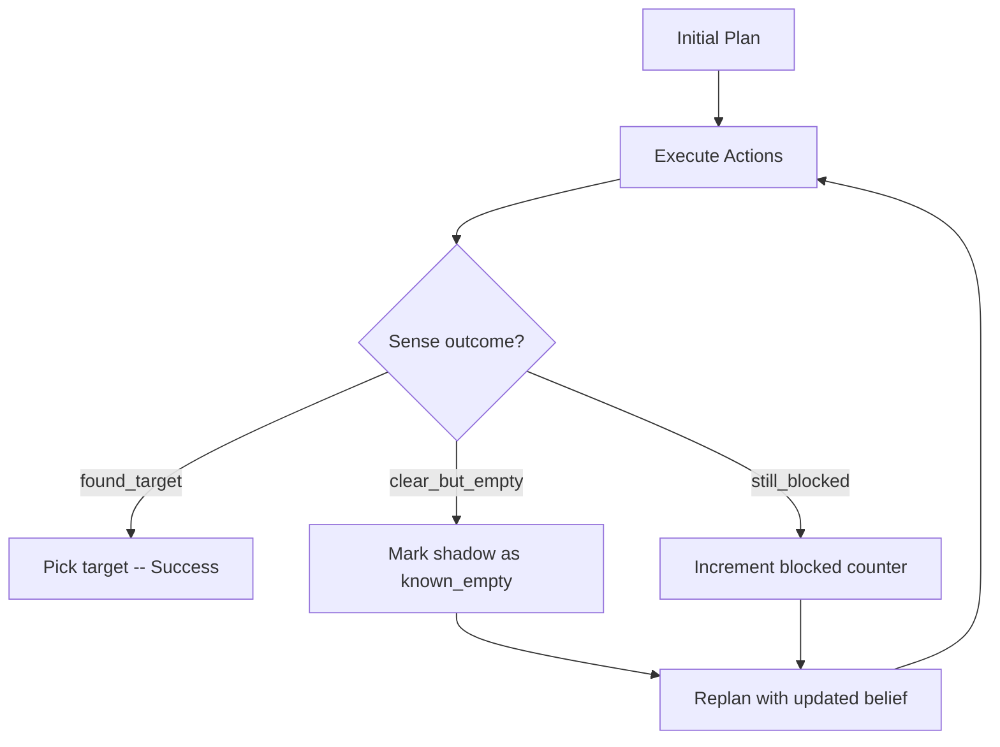

[Back to Home](Home)

# Planning System

## Overview

The planning system bridges the gap between the spatial representation (boxels) and the robot's physical actions. It uses PDDLStream -- a framework that integrates classical PDDL planning with lazy geometric stream evaluation -- to produce plans that combine symbolic reasoning (which shadow to sense, which occluder to move) with geometric reasoning (where to grasp, how to move the arm). The system is implemented in `pddlstream_planner.py` and relies on `streams.py` for the geometric stream generators documented in [Robot Control and Streams](Robot_Control_and_Streams).

---

## PDDLStreamPlanner

**Module:** `pddlstream_planner.py`  
**Class:** `PDDLStreamPlanner`

### Constructor

```python
PDDLStreamPlanner(
    registry,
    target_object,
    shadow_occluder_map,
    robot_id,
    physics_client,
    object_body_ids,
    support_body_ids
)
```

| Parameter | Type | Explanation |
|-----------|------|-------------|
| `registry` | `BoxelRegistry` | The spatial world model from [Spatial Reasoning](Spatial_Reasoning). |
| `target_object` | `str` | Name of the target to find (e.g., `"target_2"`). |
| `shadow_occluder_map` | `Dict[str, List[str]]` | Maps each shadow ID to the list of object IDs that block the camera's view to that shadow. |
| `robot_id` | `int` | PyBullet body ID of the Franka Panda. |
| `physics_client` | `int` | PyBullet client ID for the simulation. |
| `object_body_ids` | `Dict[str, int]` | Maps object names to PyBullet body IDs. Threaded to streams for collision exclusion. |
| `support_body_ids` | `List[int]` | Body IDs of support surfaces (table, plane). Excluded from collision checks during motion planning. |

The constructor:

1. Loads the PDDL domain from `pddl/domain_pddlstream.pddl`.
2. Loads the stream definitions from `pddl/stream.pddl`.
3. Creates a `BoxelStreams` instance (see [Robot Control and Streams](Robot_Control_and_Streams)) with the robot and physics parameters.
4. Exposes `home_config` -- a `RobotConfig` at the Panda's rest pose, used as the initial robot configuration.

---

## Problem Construction

The `create_problem()` method builds a PDDLStream problem tuple `(domain, constant_map, stream_map, init, goal)` from the current world state.

### `_build_init()` -- Building the Init State

The init state is the most complex part of the problem. It encodes everything the planner needs to know about the world as a set of ground atoms.



#### Type Predicates

For each boxel in the registry:

| Boxel Type | Facts Added |
|------------|-------------|
| SHADOW | `(Boxel shadow_id)`, `(is_shadow shadow_id)` |
| OBJECT | `(Boxel obj_id)`, `(is_object obj_id)`, `(Obj obj_id)` |
| FREE_SPACE | `(Boxel free_id)`, `(is_free_space free_id)` |

#### Know-If (KIF) Facts

KIF facts encode the robot's knowledge about which boxels contain the target:

- **Known-empty shadows**: For shadows in `known_empty_shadows`, add `(obj_at_boxel_KIF target shadow_id)`. This tells the planner "we know the target is NOT here" (because KIF is true but `obj_at_boxel` is absent).
- **Object and free-space boxels**: All get `(obj_at_boxel_KIF target boxel_id)`. The robot assumes the target can only be in shadow regions (not on the open table). See [Design Decisions](Design_Decisions) for why this assumption is appropriate for the overhead camera scenario.
- **Unsensed shadows**: No KIF fact is emitted. The absence means "we don't know" -- the planner may need to sense this shadow.

#### Object Position Facts

For each OBJECT boxel:

- `(obj_at_boxel obj_id obj_id)` -- the object is at its own boxel (self-location).
- `(obj_at_boxel_KIF obj_id obj_id)` -- we know this.

For **moved occluders** (from `occluders_moved` dict):

- The occluder's `obj_at_boxel` uses the destination boxel instead of the original.
- A synthetic `(Boxel dest_id)` is added for the destination.

#### Visibility Facts

From `shadow_occluder_map`:

- For each `(shadow_id, blocker_ids)` pair, and for each blocker:
  - `(blocks_view_at blocker_id blocker_boxel shadow_id)` -- static geometric fact meaning "when this object is at this position, it blocks the camera's view to this shadow."

The planner does not directly manipulate view facts. Instead, it relies on derived predicates (see [PDDL Domain Reference](PDDL_Domain_Reference)):
- Moving an occluder via pick-and-place removes its `obj_at_boxel` from the original position.
- The derived predicate `blocks_view` re-evaluates to `False`.
- `view_clear` becomes `True` for the shadow.
- The `sense` action's precondition `(view_clear ?region)` is satisfied.

#### Robot State

- `(Config home_config)`, `(at_config home_config)` -- or the current config if replanning.
- `(handempty)` -- the robot starts with an empty gripper.

#### Target Declaration

- `(Obj target_name)` -- the target is declared as an object the planner can reason about picking.

---

## Stream Map

The `_get_stream_map()` method connects PDDL stream names to Python generator functions. Each stream is wrapped in PDDLStream's `from_gen()` or `from_fn()` adapters.

| PDDL Stream | Python Generator | Explanation |
|-------------|-----------------|-------------|
| `sample-grasp` | `BoxelStreams.sample_grasp(obj_id)` | Yields `Grasp` objects for an object. See [Robot Control and Streams](Robot_Control_and_Streams). |
| `plan-motion` | `BoxelStreams.plan_motion(q1, q2)` | Yields `Trajectory` objects (collision-free paths). |
| `compute-kin` | `BoxelStreams.compute_kin_solution(obj_id, boxel_id, grasp)` | Yields `RobotConfig` solutions (IK for pick/place). |

PDDLStream calls these generators lazily during search. When the symbolic planner (FastDownward) needs a concrete grasp, IK solution, or trajectory, it triggers the corresponding stream. If the stream produces no valid result (e.g., IK failure, no collision-free path), PDDLStream retries with alternative bindings or reports failure.

---

## Planning Call

```python
planner.plan(
    current_config=current_config,
    known_empty_shadows=belief.known_empty_shadows,
    moved_occluders=belief.occluders_moved,
    goal=('obj_pose_known', target_name)
)
```

| Parameter | Type | Explanation |
|-----------|------|-------------|
| `current_config` | `RobotConfig` | The robot's actual joint configuration at plan time. |
| `known_empty_shadows` | `set` | Shadow IDs confirmed empty by previous sensing. |
| `moved_occluders` | `Dict[str, str]` | Maps relocated occluder IDs to destination boxel IDs. |
| `goal` | `tuple` | The planning goal. Default: `('obj_pose_known', target_name)`. |

The method:

1. Calls `create_problem()` with the given parameters to build the PDDL problem.
2. Optionally exports a debug PDDL file via `export_problem_pddl()`.
3. Calls PDDLStream's `solve()` with:
   - `algorithm='adaptive'` -- iteratively increases the stream evaluation budget.
   - `max_time=120` seconds.
4. Converts the solution into a list of action tuples `(action_name, (param1, param2, ...))`.

### Planning Output

A successful plan is a sequence of actions such as:

```
1. move(q_home, q_kin_obj_004_1, obj_004, traj_1)
2. pick(obj_004, obj_004, grasp_obj_004_0, q_kin_obj_004_1)
3. move(q_kin_obj_004_1, q_kin_obj_004_3, free_023, traj_2)
4. place(obj_004, free_023, grasp_obj_004_0, q_kin_obj_004_3)
5. sense(target_2, shadow_001)
6. move(q_kin_obj_004_3, q_kin_target_2_0, shadow_001, traj_3)
7. pick(target_2, shadow_001, grasp_target_2_0, q_kin_target_2_0)
```

This plan says: move to the occluder, pick it up, move to free space, place it there, sense the now-visible shadow, move to the target, pick it up.

---

## Replanning Architecture

The planning system supports reactive replanning: when a plan fails during execution (typically because sensing reveals the target is not in the expected shadow), the execution loop updates the belief state and requests a new plan.



### Belief State Propagation

Across replanning cycles, the following information is preserved:

| Information | How It Propagates |
|-------------|-------------------|
| Known-empty shadows | `known_empty_shadows` set grows monotonically. Each replan excludes already-sensed shadows via KIF facts. |
| Moved occluders | `occluders_moved` dict maps relocated objects to their new positions. Each replan places them at their destinations. |
| Robot configuration | `current_config` is read from PyBullet's actual joint state, not from the previous plan's expected outcome. |

### Convergence Guarantee

For N shadow candidates, the system converges in at most N replan cycles (one per empty shadow). The `max_replans` formula `4*N + 1` provides additional margin for retry attempts on blocked shadows. Each replan searches strictly fewer candidates because `known_empty_shadows` grows monotonically.

### Debug Export

`export_problem_pddl(filepath)` writes the static portion of the PDDL problem to a file for offline analysis with external PDDL tools. The exported file is saved as an artefact in the run log directory.

---

**See Also:**
- [PDDL Domain Reference](PDDL_Domain_Reference) -- The formal PDDL domain (actions, predicates, derived predicates).
- [Robot Control and Streams](Robot_Control_and_Streams) -- The stream generators that produce geometric solutions.
- [Execution Pipeline](Execution_Pipeline) -- How plans are executed and how replanning is triggered.
- [Core Data Structures](Core_Data_Structures) -- `BoxelRegistry`, `RobotConfig`, `Trajectory`, `Grasp`.
- [Design Decisions](Design_Decisions) -- Why optimistic sensing with replanning was chosen over conditional planning.

---

[Back to Home](Home)
