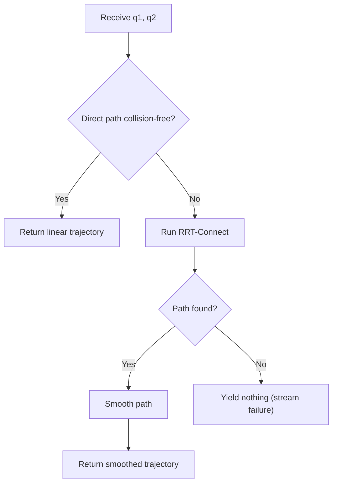

[Back to Home](Home)

# Robot Control and Streams

## Overview

This page documents the low-level robot control utilities and the PDDLStream stream generators that bridge symbolic planning with physical geometry. The robot control layer (`robot_utils.py`) provides Franka Panda constants, inverse kinematics, collision checking, and motor actuation. The stream layer (`streams.py`) wraps these into lazy generators that PDDLStream calls during planning to produce grasps, IK solutions, and collision-free trajectories.

---

## Franka Panda Constants

**Module:** `robot_utils.py`

All Panda-specific values are defined once in `robot_utils.py` and imported by all consumers.

| Constant | Value | Explanation |
|----------|-------|-------------|
| `ARM_JOINT_INDICES` | `[0, 1, 2, 3, 4, 5, 6]` | The 7 revolute joints of the Panda arm. |
| `FINGER_JOINTS` | `[9, 10]` | The two parallel-jaw gripper finger joints. |
| `END_EFFECTOR_LINK` | `11` | PyBullet link index for the Panda's end-effector (flange). |
| `JOINT_LIMITS_LOW` | `[-2.8973, -1.7628, -2.8973, -3.0718, -2.8973, -0.0175, -2.8973]` | Lower joint limits in radians (from Panda datasheet). |
| `JOINT_LIMITS_HIGH` | `[2.8973, 1.7628, 2.8973, -0.0698, 2.8973, 3.7525, 2.8973]` | Upper joint limits in radians. |
| `JOINT_RANGES` | Computed from limits | `HIGH - LOW` per joint. |
| `REST_POSES` | `[0, -0.785, 0, -2.356, 0, 1.571, 0.785]` | Home configuration. The arm is folded above the base, clear of the workspace. |

---

## Inverse Kinematics

### `solve_ik()` (robot_utils.py)

The execution-side IK solver. Used for approach, contact, lift, and retreat waypoints during pick and place.

```python
solve_ik(robot_id, target_pos, target_orn, physics_client) -> Optional[list]
```

**Algorithm:**

1. Save the robot's current joint state.
2. Reset all arm joints to `REST_POSES` (provides a consistent seed).
3. Call `p.calculateInverseKinematics()` with:
   - Null-space parameters: `lowerLimits`, `upperLimits`, `jointRanges`, `restPoses`.
   - 100 max iterations, 1e-4 residual threshold.
4. Clip the result to joint limits with 0.1 rad tolerance margin.
5. Validate: reject if any joint exceeds limits.
6. Restore the original joint state.
7. Return the 7-element joint angle list, or `None` on failure.

The null-space parameters bias the solution toward the rest pose, improving convergence and producing arm-folded configurations that are less likely to collide with the environment.

### `_pybullet_ik()` (streams.py)

The planning-side IK solver. Identical algorithm to `solve_ik()` but used inside stream generators during PDDLStream planning.

**Multi-seed strategy:**

`compute_kin_solution()` calls `_pybullet_ik()` with 8 different seeds to explore multiple IK local minima:

| Seed | Description |
|------|-------------|
| 0 | `REST_POSES` (default) |
| 1-7 | `REST_POSES + _IK_SEED_OFFSETS[i]` |

`_IK_SEED_OFFSETS` are 7 hand-tuned perturbation vectors that steer the IK solver into different arm configurations. Each seed produces a different joint solution for the same end-effector target, giving the planner more options to find collision-free configurations.

---

## Collision Checking

### `is_config_collision_free()` (robot_utils.py)

Checks whether a given arm configuration collides with the environment.

```python
is_config_collision_free(
    robot_id, config, physics_client,
    ignored_body_ids=frozenset(),
    allow_gripper_collisions=False
) -> bool
```

**Algorithm:**

1. Save the robot's current joint state.
2. Set arm joints to the query configuration.
3. Call `p.performCollisionDetection()`.
4. Call `p.getContactPoints(robot_id)`.
5. Filter out:
   - Known self-contact pairs (`_PANDA_IGNORED_SELF_PAIRS`): adjacent links that always touch.
   - Base link (link -1) contacts with the ground.
   - Contacts with bodies in `ignored_body_ids` (e.g., the grasped object).
   - If `allow_gripper_collisions=True`: contacts between gripper links (6-11) and any environment body.
6. Restore original joint state.
7. Return `True` if no remaining contacts.

### `is_path_collision_free()` (robot_utils.py)

Checks whether a straight-line joint-space path between two configurations is collision-free.

```python
is_path_collision_free(
    robot_id, config_a, config_b, physics_client,
    n_checks=8, ignored_body_ids=frozenset(),
    allow_gripper_collisions=False
) -> bool
```

Samples `n_checks` configurations along the linear interpolation from `config_a` to `config_b` and calls `is_config_collision_free()` on each. Returns `True` only if all samples pass.

---

## Motion Planning

### `plan_motion()` (streams.py)

The PDDLStream stream generator for collision-free trajectories.

```python
BoxelStreams.plan_motion(q1: RobotConfig, q2: RobotConfig) -> Generator[Trajectory]
```

**Three-tier strategy:**



**Tier 1 -- Direct path:**
Check the straight line from `q1` to `q2` using `is_path_collision_free()` with 8 samples. If clear, return a two-waypoint trajectory (fast path for unobstructed motions).

**Tier 2 -- RRT-Connect:**
Bidirectional rapidly-exploring random tree (Kuffner & LaValle, 2000):

| Parameter | Value | Explanation |
|-----------|-------|-------------|
| `RRT_MAX_ITERATIONS` | 2000 | Maximum tree expansion iterations. |
| `RRT_STEP_SIZE` | 0.2 rad | Maximum joint-space step per extension. |
| `RRT_GOAL_BIAS` | 0.05 (5%) | Probability of sampling the goal instead of a random config. |
| `RRT_EDGE_CHECKS` | 8 | Collision samples per edge during tree extension. |
| `RRT_CONNECT_ATTEMPTS` | 50 | Maximum connect-phase extensions toward the other tree. |

The algorithm maintains two trees (one from start, one from goal). Each iteration:
1. Sample a random configuration (or the goal with 5% probability).
2. Extend the nearest node in the active tree toward the sample.
3. Attempt to connect the other tree to the new node.
4. If trees connect, extract and return the path.
5. Swap active/passive trees.

**Tier 3 -- Shortcut smoothing:**

| Parameter | Value | Explanation |
|-----------|-------|-------------|
| `SMOOTH_ATTEMPTS` | 75 | Number of random shortcut attempts. |

For each attempt: pick two non-adjacent waypoints, check if the direct edge between them is collision-free. If so, remove all intermediate waypoints.

**Collision exclusions:**
`plan_motion()` unions both endpoints' `ignored_body_ids` and includes `support_body_ids` in the ignore set. This ensures the grasped object and the table surface do not cause false collisions. `allow_gripper_collisions=True` is set for all pick/place motions.

---

## Grasp Sampling

### `sample_grasp()` (streams.py)

The PDDLStream stream generator for grasp poses.

```python
BoxelStreams.sample_grasp(obj_id: str) -> Generator[Grasp]
```

Yields 3 top-down grasps per object:

| Grasp | Z Offset | Explanation |
|-------|----------|-------------|
| 0 | 0.05 m | Close to object center. Tight grasp, less arm clearance. |
| 1 | 0.10 m | Medium offset. Balanced clearance and stability. |
| 2 | 0.15 m | High offset. Maximum arm clearance, looser grasp. |

All grasps share the same orientation: gripper pointing straight down (`euler_to_quat(0, pi, 0)`). The grasp position is relative to the object center: `(0, 0, z_offset)`.

**Limitation:** Only top-down grasps are generated. No lateral or angled grasps. This restricts the system to tabletop scenarios where objects are accessible from above. See [Known Issues and Roadmap](Known_Issues_and_Roadmap), PA-6.

---

## Kinematic Solutions

### `compute_kin_solution()` (streams.py)

The PDDLStream stream generator for IK solutions at a specific boxel.

```python
BoxelStreams.compute_kin_solution(
    obj_id: str, boxel_id: str, grasp: Grasp
) -> Generator[RobotConfig]
```

**Algorithm:**

1. Look up the boxel's center from the registry.
2. Compute the target end-effector position: `boxel.center + grasp.position`.
3. For each of 8 IK seeds:
   a. Call `_pybullet_ik()` with the seed, target position, and grasp orientation.
   b. If IK succeeds, create a `RobotConfig` with:
      - `joint_positions`: the IK solution.
      - `ignored_body_ids`: `{body_id}` of the grasped object (resolved via `object_body_ids`).
   c. Yield the config.

The `ignored_body_ids` field is a hidden side-channel: the PDDL planner sees only the symbolic `(kin_solution ?o ?b ?g ?q)` fact, but the Python `RobotConfig` object carries the collision exclusion set. When `plan_motion()` later plans a path to this config, it reads `ignored_body_ids` and excludes the grasped object from collision checks.

---

## RenderingLock

**Module:** `robot_utils.py`  
**Class:** `RenderingLock`

A context manager that disables PyBullet rendering during planning to prevent visual flicker.

**Mechanism:** Reference-counted. The first `acquire()` (count 0 -> 1) calls `configureDebugVisualizer(COV_ENABLE_RENDERING, 0)`. The last `release()` (count 1 -> 0) re-enables rendering. Nested locks increment/decrement the counter without toggling.

**Usage:**
- The outer planning call in `test_full_pipeline.py` wraps `planner.plan()` with a `RenderingLock`.
- Inner calls in `is_config_collision_free()`, `is_path_collision_free()`, `solve_ik()`, and `_pybullet_ik()` also use `RenderingLock`.
- Thanks to reference counting, rendering is toggled exactly twice per planning phase (once off, once on), regardless of how many inner locks nest.

---

## Actuation

### `move_robot_smooth()` (robot_utils.py)

Moves the robot arm to a target configuration using position control with physics simulation.

```python
move_robot_smooth(robot_id, target_config, gui=False, n_steps=60)
```

| Parameter | Value | Explanation |
|-----------|-------|-------------|
| `n_steps` | 60 | Number of simulation steps for the motion. |
| `force` | 240 N*m | Motor force per joint. |

For each step, `p.setJointMotorControl2(POSITION_CONTROL)` is called for all 7 arm joints, then `p.stepSimulation()`. If `gui=True`, a short sleep is added for visual smoothness.

### `open_gripper()` / `close_gripper()` (robot_utils.py)

Control the parallel-jaw gripper.

| Function | Finger Target | Force | Steps |
|----------|---------------|-------|-------|
| `open_gripper()` | 0.04 m per finger | 50 N | 60 |
| `close_gripper()` | 0.01 m per finger | 50 N | 60 |

The Panda's max finger opening is 0.08 m (0.04 m per finger). `close_gripper()` drives fingers to near-closed position. Combined with `p.createConstraint()` for the grasp attachment, this provides visually correct gripper motion while the constraint holds the object.

---

**See Also:**
- [Planning System](Planning_System) -- How streams are connected to the PDDLStream planner.
- [Execution Pipeline](Execution_Pipeline) -- How `solve_ik()`, `move_robot_smooth()`, and gripper functions are used during action execution.
- [Core Data Structures](Core_Data_Structures) -- `RobotConfig`, `Trajectory`, `Grasp`.
- [PDDL Domain Reference](PDDL_Domain_Reference) -- The PDDL stream declarations that these generators implement.
- [Design Decisions](Design_Decisions) -- Why constraint-based grasping is used instead of friction-based.

---

[Back to Home](Home)
