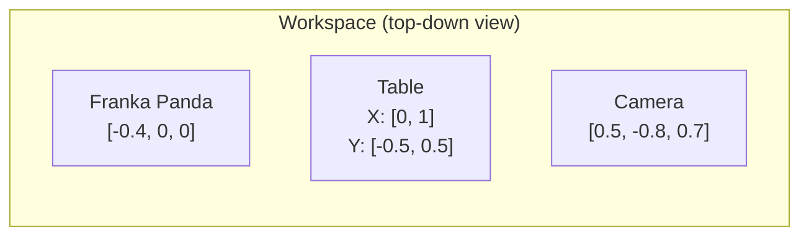

[Back to Home](Home)

# Scene Environment

## Overview

The scene environment module (`boxel_env.py`) is responsible for setting up and managing the PyBullet simulation that the entire system operates within. It creates the physical world -- table, robot, occluders, and targets -- configures the camera, and provides the perception interface that produces boxels from the scene. The `BoxelTestEnv` class is the central facade through which the [Execution Pipeline](Execution_Pipeline) interacts with the physics simulation.

---

## BoxelTestEnv

`BoxelTestEnv` is the main environment class. It owns the PyBullet physics client, the scene objects, the camera parameters, and the helper modules for spatial reasoning.

### Constructor

```python
BoxelTestEnv(gui=True, scene_config=None)
```

| Parameter | Type | Default | Explanation |
|-----------|------|---------|-------------|
| `gui` | `bool` | `True` | Whether to open a PyBullet GUI window. Set `False` for headless runs. |
| `scene_config` | `Optional[SceneConfig]` | `None` | Scene to create. If `None`, uses `default_scene()`. |

The constructor performs:

1. Connects to PyBullet (GUI or DIRECT mode).
2. Sets gravity to 9.81 m/s^2 downward.
3. Calls `_setup_scene()` to create all physical objects.
4. Initializes helper modules: `ShadowCalculator`, `FreeSpaceGenerator`, `BoxelVisualizer`.
5. Stores camera parameters (position, target, FOV, resolution).

### Key Attributes

| Attribute | Type | Explanation |
|-----------|------|-------------|
| `client_id` | `int` | PyBullet physics client ID. Passed to the planner and streams. |
| `robot_id` | `int` | PyBullet body ID of the Franka Panda robot. |
| `table_id` | `int` | PyBullet body ID of the table. |
| `plane_id` | `int` | PyBullet body ID of the ground plane. |
| `occluder_ids` | `Dict[str, int]` | Maps occluder names to PyBullet body IDs. |
| `target_ids` | `Dict[str, int]` | Maps target names to PyBullet body IDs. |
| `objects` | `Dict[str, ObjectInfo]` | All scene objects indexed by name. |
| `camera_position` | `list` | Camera world position `[0.5, -0.8, 0.7]`. |
| `camera_target` | `list` | Camera look-at point `[0.5, 0.0, 0.5]`. |
| `table_surface_height` | `float` | Z coordinate of the table top (~0.325 m). |
| `table_x_range` | `tuple` | Table extent in X: `(0.0, 1.0)` meters. |
| `table_y_range` | `tuple` | Table extent in Y: `(-0.5, 0.5)` meters. |

---

## Scene Layout

The simulation uses a fixed coordinate frame where the table occupies the positive-X half of the workspace.



### Physical Dimensions

| Entity | Position | Dimensions | Notes |
|--------|----------|-----------|-------|
| Ground plane | Origin | Infinite | PyBullet built-in `plane.urdf` |
| Table | `[0.5, 0.0, 0.0]` | 1.0 x 1.0 m surface | Surface height ~0.325 m after URDF offset |
| Franka Panda | `[-0.4, 0.0, 0.0]` | Standard URDF | Base on ground plane, reaches across table |
| Occluders | Various on table | Default: 0.15 m cubes | 3 in default scene |
| Targets | Various behind occluders | Default: 0.08 m cubes | 4 in default scene |
| Camera | `[0.5, -0.8, 0.7]` | N/A | Fixed overhead, looking at `[0.5, 0, 0.5]` |

### Default Object Positions

**Occluders** (default scene):

| Name | Position (X, Y) | Size | Color |
|------|-----------------|------|-------|
| `occluder_1` | `(0.5, 0.2)` | 0.15 m cube | Red |
| `occluder_2` | `(0.3, -0.1)` | 0.15 m cube | Red |
| `occluder_3` | `(0.7, -0.1)` | 0.15 m cube | Red |

**Targets** (default scene):

| Name | Position (X, Y) | Size | Color |
|------|-----------------|------|-------|
| `target_1` | `(0.5, 0.35)` | 0.08 m cube | Blue |
| `target_2` | `(0.3, 0.1)` | 0.08 m cube | Blue |
| `target_3` | `(0.7, 0.1)` | 0.08 m cube | Blue |
| `target_4` | `(0.5, -0.25)` | 0.08 m cube | Blue |

All objects are placed with their base on the table surface. The Z coordinate is computed as `table_surface_height + half_height`.

---

## Scene Setup (`_setup_scene`)

The `_setup_scene()` method is called once during construction. It performs the following sequence:

1. **Load ground plane** -- `p.loadURDF("plane.urdf")`.
2. **Load table** -- `p.loadURDF("table/table.urdf")` at `[0.5, 0, 0]`. The table surface height is extracted from the AABB.
3. **Load Franka Panda** -- `p.loadURDF("franka_panda/panda.urdf")` at `[-0.4, 0, 0]` with fixed base. Joints are set to `REST_POSES` from `robot_utils.py`. Gripper is opened.
4. **Create occluders** -- Iterates over `scene_config.occluders`, creating each with `p.createCollisionShape()` + `p.createMultiBody()`. Supports BOX, CYLINDER, and SPHERE shapes.
5. **Create targets** -- Same process for targets.
6. **Settle physics** -- Runs 10 `p.stepSimulation()` calls to let objects settle under gravity.

---

## Scene Presets

Three preset scene configurations are available via factory functions. These are selected with the `--scene` CLI flag.

### `default_scene()`

The original hardcoded scene with 3 occluder cubes and 4 target cubes at fixed positions. This is the scene used for all development and debugging.

### `mixed_shapes_scene()`

A demonstration scene with diverse object shapes: cylinders, boxes, and spheres of varying sizes. Tests that the spatial reasoning pipeline handles non-cubic geometries.

### `scalability_scene(n_occluders, n_targets, seed)`

A randomly generated scene for evaluation experiments. Uses `_random_xy_positions()` with rejection sampling to place objects without overlap. The `seed` parameter ensures reproducibility. Intended for use with the evaluation framework (not yet implemented -- see [Known Issues and Roadmap](Known_Issues_and_Roadmap), #76).

---

## Camera Model

The system uses a fixed overhead camera for all perception and sensing operations. The camera never moves during a run.

| Parameter | Value | Explanation |
|-----------|-------|-------------|
| Position | `[0.5, -0.8, 0.7]` | Offset from table center, elevated and angled |
| Target | `[0.5, 0.0, 0.5]` | Look-at point (table center, slightly elevated) |
| Up vector | `[0, 0, 1]` | World Z-up |
| FOV | 60 degrees | Vertical field of view |
| Resolution | 640 x 480 | Width x Height in pixels |
| Near plane | 0.1 m | Minimum render distance |
| Far plane | 3.0 m | Maximum render distance |

The camera parameters are used by:
- `oracle_detect_objects()` for visibility determination.
- `ShadowCalculator` for shadow projection direction.
- `sense_shadow_raycasting()` for sensing ray origins.

---

## Oracle Object Detection

`oracle_detect_objects()` determines which scene objects are visible from the camera. It uses PyBullet raycasting rather than rendered images.

### Algorithm

For each object in the scene:

1. Compute the object's AABB (axis-aligned bounding box) from its position and size.
2. Generate 8 ray targets at the AABB corners (all combinations of min/max X, Y, Z).
3. Cast 8 rays from the camera position to these corners using `p.rayTestBatch()`.
4. The object is **visible** if ANY ray's first-hit body ID matches the object's body ID.

This multi-ray approach handles partial visibility: even if most of an object is hidden behind an occluder, it is detected as visible if any corner is unobstructed.

### Returns

| Field | Type | Content |
|-------|------|---------|
| `visible_objects` | `List[str]` | Names of visible objects |
| `object_poses` | `Dict[str, Tuple]` | Maps all object names to `(position, orientation)` |

Hidden objects (all rays blocked by other objects) are excluded from `visible_objects` but remain in `object_poses`. This distinction is critical: the planner only reasons about visible objects, but the execution loop can still query hidden objects' positions for ground-truth validation.

---

## Observation Pipeline

The `get_camera_observation()` method orchestrates the full perception cycle:

1. Calls `oracle_detect_objects()` to get visible objects and poses.
2. Calls `generate_boxels(visible_objects)` to compute object and shadow boxels.
3. Returns a `CameraObservation` containing all results.

The free-space computation is triggered separately via `generate_free_space(known_boxels)` because it depends on having both object and shadow boxels as input.

### Boxel Generation (`generate_boxels`)

For each visible object:

1. Compute the object's AABB from its position and size.
2. Create an object `Boxel` with `center`, `extent`, and `object_name`.
3. Call `ShadowCalculator.calculate_shadow_boxel()` to compute shadow regions.
4. If shadows are produced, mark the object boxel as `is_occluder = True`.

The result is a flat list of `Boxel` objects (both object and shadow types) that feeds into the free-space generator and ultimately the `BoxelRegistry`.

### Free Space Generation (`generate_free_space`)

Delegates to `FreeSpaceGenerator.generate(known_boxels)`. See [Spatial Reasoning](Spatial_Reasoning) for the octree subdivision algorithm.

---

## Environment Management

### `update_object_positions()`

Synchronizes the `objects` dictionary with actual PyBullet poses. Called after physics settling, after pick/place actions, and before replanning. Ensures the planner and execution code always have current object positions.

### `reset(scene_config=None)`

Tears down the current scene and rebuilds it. If a new `scene_config` is provided, uses that; otherwise rebuilds the same scene. Used for batch evaluation runs.

### `close()`

Disconnects the PyBullet client and cleans up resources.

---

## BoxelVisualizer

`visualization.py` provides the `BoxelVisualizer` class for debug drawing in the PyBullet GUI.

| Method | Explanation |
|--------|-------------|
| `draw_boxels(boxels, duration)` | Draws wireframes and semi-transparent phantoms for each boxel. Colors: red (occluder objects), blue (non-occluder objects), gray (shadows), green (free space). |
| `clear_all()` | Removes all debug drawing items. |

The visualizer is instantiated in `BoxelTestEnv.__init__()` but is currently not called from active code. It was intentionally disabled to reduce visual noise during pipeline runs. See [Known Issues and Roadmap](Known_Issues_and_Roadmap), #90.

---

**See Also:**
- [Core Data Structures](Core_Data_Structures) -- `ObjectInfo`, `Boxel`, `SceneConfig`, `ObjectSpec`, `CameraObservation`.
- [Spatial Reasoning](Spatial_Reasoning) -- Shadow calculation, free space, and cell merging triggered by this module.
- [Execution Pipeline](Execution_Pipeline) -- How the environment is used during plan execution.
- [Architecture Overview](Architecture_Overview) -- Where this module fits in the overall system.

---

[Back to Home](Home)
