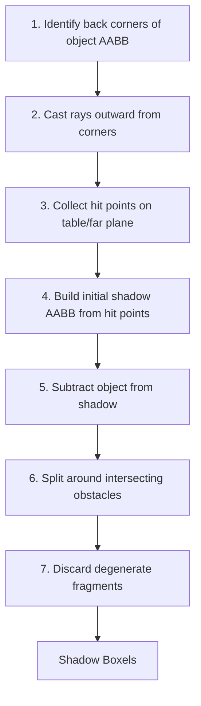
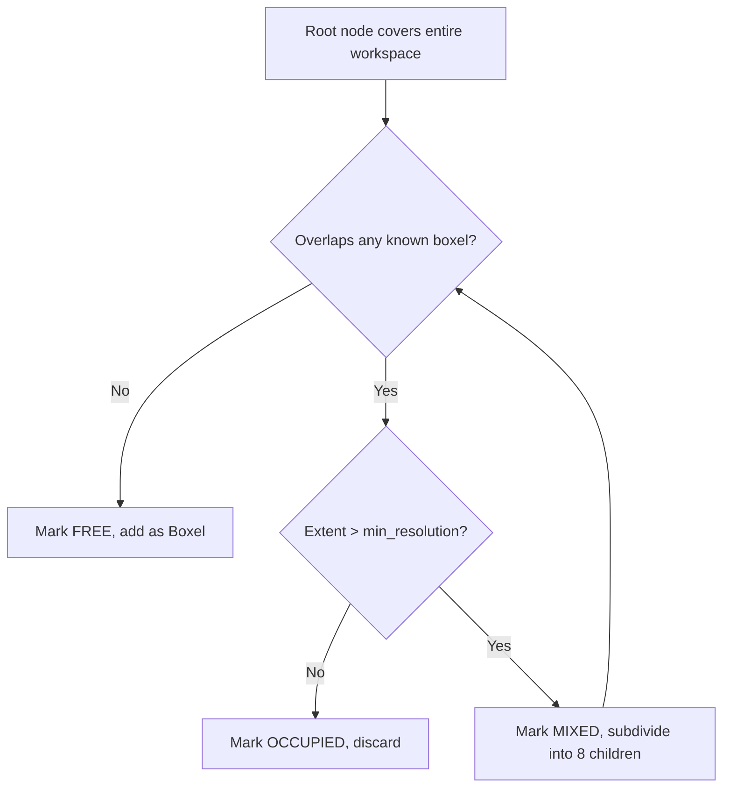

[Back to Home](Home)

# Spatial Reasoning

## Overview

The spatial reasoning subsystem transforms raw object detections into a complete, typed spatial map of the workspace. It answers three questions: where are the objects (object boxels), what is hidden behind them (shadow boxels), and where is the empty space (free-space boxels). These three boxel types together form the `BoxelRegistry` that the [Planning System](Planning_System) uses as its world model. The subsystem spans three modules: `shadow_calculator.py`, `free_space.py`, and `cell_merger.py`, with the final assembly in `boxel_data.py`.

---

## Shadow Calculation

**Module:** `shadow_calculator.py`  
**Class:** `ShadowCalculator`

The shadow calculator computes the regions on the table that are occluded from the camera's viewpoint by each object. These shadow regions are where hidden targets might be located.

### Algorithm

The algorithm uses PyBullet raycasting to project object silhouettes onto the table surface:

**Step 1 -- Back-corner identification:**
For each object, compute the AABB corners. Identify the "back" corners -- those facing away from the camera. This is determined by the dot product of the camera-to-corner vector with the camera-to-object-center vector: corners where the projection exceeds the center's projection are "back" corners.

**Step 2 -- Ray casting:**
Cast rays from each back corner outward (away from the camera), extending up to `max_ray_distance` (5.0 m). These rays trace the shadow boundary: they start at the occluder's silhouette edge and project toward the table.

**Step 3 -- Hit point collection:**
Collect the world-space hit points from `p.rayTestBatch()`. Points are clamped to the table bounds (`table_x_range`, `table_y_range`) to prevent shadows from extending off the workspace.

**Step 4 -- Initial shadow AABB:**
Construct a bounding box from all hit points and the object's back face. The shadow's Z range spans from the table surface up to at least the object's height (conservative overestimate).

**Step 5 -- Object subtraction:**
The initial shadow AABB overlaps with the occluder itself. The occluder is subtracted by splitting the shadow along the primary shadow direction axis, keeping only the portion behind the occluder.

**Step 6 -- Obstacle splitting:**
For each other object in the scene, check if its AABB intersects any current shadow fragment. If so, use `_subtract_aabb()` to carve the obstacle out of the shadow. This produces up to 6 fragments per subtraction (one per face of the obstacle's AABB). Fragments that are "downstream" of the obstacle (closer to the camera than the obstacle) are discarded.

**Step 7 -- Degenerate filtering:**
Fragments with any extent below `MIN_EXTENT` (0.001 m) are discarded.

### Parameters

| Parameter | Value | Source | Explanation |
|-----------|-------|--------|-------------|
| `max_ray_distance` | 5.0 m | `shadow_calculator.py` | Maximum ray travel distance. Far exceeds workspace bounds. |
| `MIN_EXTENT` | 0.001 m | `shadow_calculator.py` | Minimum valid extent for a shadow fragment. |
| `downstream_tolerance` | 1e-4 m | `shadow_calculator.py` | Tolerance for downstream fragment detection. |
| `camera_position` | `[0.5, -0.8, 0.7]` | From `BoxelTestEnv` | Determines shadow projection direction. |
| `table_surface_height` | ~0.325 m | From `BoxelTestEnv` | Shadow Z minimum. |
| `table_x_range` | `(0.0, 1.0)` | From `BoxelTestEnv` | Clamps shadow X extent. |
| `table_y_range` | `(-0.5, 0.5)` | From `BoxelTestEnv` | Clamps shadow Y extent. |

### AABB Subtraction (`_subtract_aabb`)

When an obstacle intersects a shadow, the shadow is split into up to 6 axis-aligned fragments:

| Fragment | Region |
|----------|--------|
| X-negative | Shadow portion with `x < obstacle.x_min` |
| X-positive | Shadow portion with `x > obstacle.x_max` |
| Y-negative | Remaining portion with `y < obstacle.y_min` |
| Y-positive | Remaining portion with `y > obstacle.y_max` |
| Z-negative | Remaining portion with `z < obstacle.z_min` |
| Z-positive | Remaining portion with `z > obstacle.z_max` |

Each split operates on the residual after previous splits, preventing double-counting.

---

## Free Space Generation

**Module:** `free_space.py`  
**Class:** `FreeSpaceGenerator`

The free-space generator discretizes the workspace volume above the table into cells, marking each as free (no overlap with any known boxel) or occupied. Free cells become candidate locations where the robot can place relocated occluders.

### Algorithm

The algorithm uses a BFS (breadth-first search) octree subdivision:

**Root node:**
Covers the workspace bounds: X `[0, 1]` m, Y `[-0.5, 0.5]` m, Z `[table_surface, table_surface + 0.5]` m.

**Subdivision:**
Each MIXED node is split into 8 equal children (octants). Children inherit half the parent's extent in each dimension.

**Termination:**
A node becomes a leaf when either:
- It has no overlap with any known boxel (FREE).
- Its maximum dimension is at or below `min_resolution` (OCCUPIED).

**Output:**
All FREE leaf nodes are converted to `Boxel` objects with `is_free=True` and `object_name="free_space"`.

### Parameters

| Parameter | Value | Explanation |
|-----------|-------|-------------|
| `min_resolution` | 0.035 m | Minimum cell size. Approximately half the target object size (0.08 m), ensuring free cells are large enough to hold targets. |
| `workspace_height` | 0.5 m | Height of the workspace volume above the table. |

---

## Cell Merging

**Module:** `cell_merger.py`  
**Class:** `CellMerger`

The octree produces many small free-space cells. The cell merger combines adjacent, axis-aligned cells into larger convex regions to reduce the number of boxels the planner must reason about.

### Algorithm

The merger runs iterative greedy passes:

1. **For each pair of boxels**, check if they can be merged:
   - They must share a face (aligned on 2 axes, adjacent on the third).
   - The shared face dimensions must match within tolerance.
2. **Among all mergeable pairs**, select the merge with the highest quality score.
3. **Merge** the selected pair into a single larger boxel.
4. **Repeat** until no more merges are possible, or `max_iterations` is reached.

### Merge Conditions (`_try_merge`)

Two boxels are mergeable if:
- They are aligned on exactly 2 of 3 axes (shared face dimensions match within `tolerance`).
- They are adjacent on the remaining axis: `a_max[axis] ≈ b_min[axis]` or vice versa.

### Merge Quality (`_merge_quality`)

When multiple merges are possible, the algorithm prefers merges that produce more cubic (isotropic) results. The quality metric is the ratio of the smallest to largest extent of the merged boxel. A perfect cube scores 1.0; an elongated slab scores near 0.

### Parameters

| Parameter | Value | Explanation |
|-----------|-------|-------------|
| `tolerance` | 1e-4 m | Tolerance for face alignment and adjacency checks. |
| `max_iterations` | 100 | Maximum number of merge passes before stopping. |

### Post-Processing

After merging, all remaining boxels are updated:
- `object_name` is set to `"free_space_merged"`.
- `is_free` is set to `False` (distinguishes merged from raw free-space).

The wrapper function `merge_free_space_cells(free_boxels)` provides a convenient entry point used by `test_full_pipeline.py`.

---

## Registry Construction

**Module:** `boxel_data.py`  
**Function:** `create_boxel_registry_from_boxels(boxels: List[Boxel]) -> BoxelRegistry`

This function is the final assembly step: it takes the flat list of `Boxel` objects (object boxels + shadow boxels + merged free-space boxels) and converts them into a typed `BoxelRegistry` with unique IDs and relationships.

### Process

1. **Type inference**: Each `Boxel` is classified as:
   - `OBJECT` if `object_name` is set and not a free-space name.
   - `SHADOW` if `is_shadow` is `True`.
   - `FREE_SPACE` if `is_free` is `True` or `object_name` contains `"free_space"`.

2. **ID assignment**: Each boxel receives a unique ID from the registry's counter:
   - Object boxels: `obj_000`, `obj_001`, ...
   - Shadow boxels: `shadow_000`, `shadow_001`, ...
   - Free-space boxels: `free_000`, `free_001`, ...

3. **Geometry conversion**: `Boxel.center` and `Boxel.extent` are converted to `BoxelData.min_corner` and `BoxelData.max_corner`.

4. **Shadow-object linking**: For each shadow boxel, the function finds the object boxel whose name matches `shadow.object_name` (the occluder) and sets:
   - `shadow.created_by_boxel_id` = object boxel's ID.
   - `shadow.created_by_object` = occluder's name.
   - Object boxel's `shadow_boxel_ids` list includes the shadow's ID.

5. **Surface detection**: All boxels touching the table surface (Z_min within tolerance of `surface_z`) are tagged with `on_surface="table"`.

### Output

A `BoxelRegistry` containing all classified boxels, serializable to JSON and consumable by the [Planning System](Planning_System).

### Typical Counts (Default Scene)

| Type | Count | Notes |
|------|-------|-------|
| Object boxels | ~7 | 3 occluders + 4 visible targets (hidden targets excluded) |
| Shadow boxels | ~6 | 1-3 shadows per occluder, split around obstacles |
| Free-space boxels | ~45-50 | After octree subdivision + merging |
| **Total** | **~57** | |

---

**See Also:**
- [Core Data Structures](Core_Data_Structures) -- `Boxel`, `BoxelData`, `BoxelRegistry`, `OctreeNode`.
- [Scene Environment](Scene_Environment) -- Where `generate_boxels()` and `generate_free_space()` are called.
- [Planning System](Planning_System) -- How the `BoxelRegistry` feeds into PDDL problem construction.
- [Architecture Overview](Architecture_Overview) -- Where spatial reasoning fits in the data flow.

---

[Back to Home](Home)
